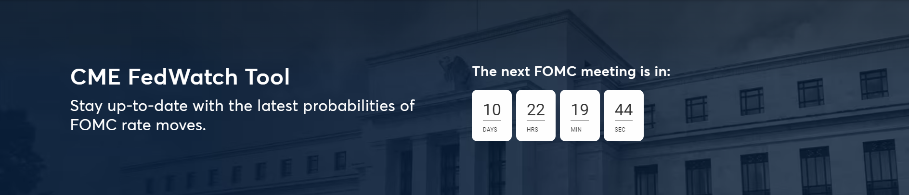
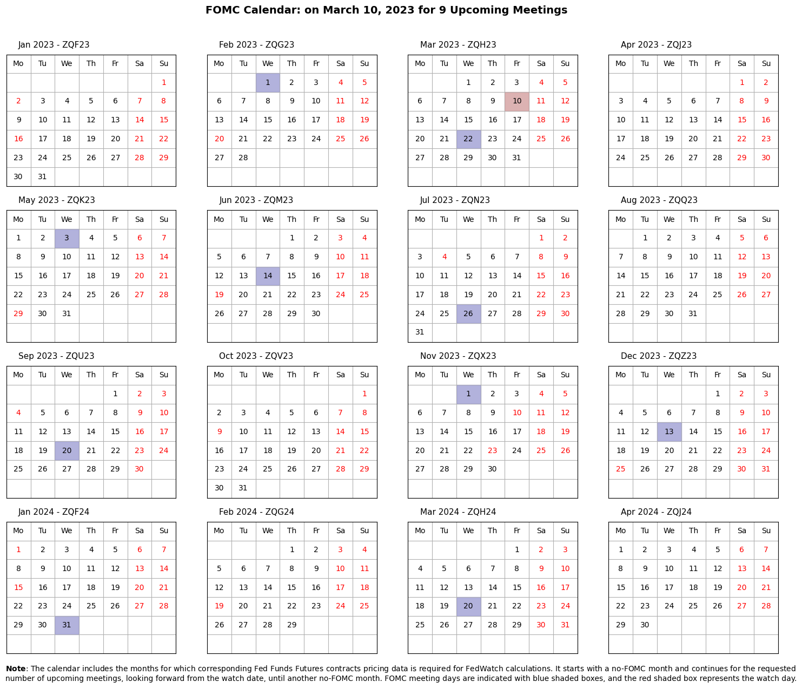
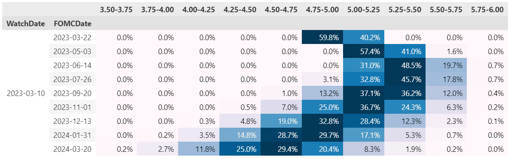

   
   

# Welcome to the Python Implementation of CME FedWatch Tool!

     

>This repo is public facing and exists for the sole purpose of explaining how the CME FedWatch tool calculates the probabilities of FOMC rate moves.

     

## What is CME FedWatch Tool and PyFedWatch?

The __FedWatch__ is a tool that calculates the implied probabilities of potential changes in the Federal Reserve's target federal funds rate at upcoming Federal Open Market Committee (FOMC) meetings, using the Fed Fund futures prices. __PyFedWatch__ is python implementation of the FedWatch tool.

 

> PyFedWatch FOMC Calender:

   
   
   </a>
   

 

> PyFedWatch calculated probabilities of target rates for 9 upcoming FOMC meetings, on 2023-03-10:

   
   
   </a>
   

## Contact Information

You can contact me via email: a.rahimi.aut@gmail.com
